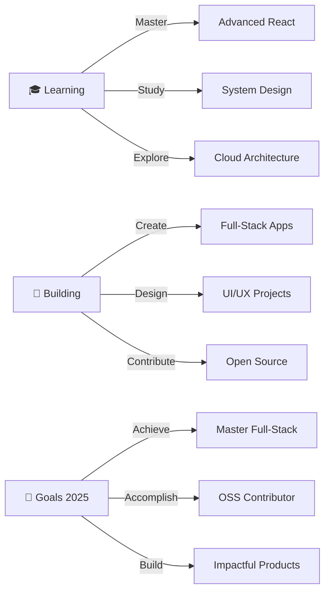

<p align="center">
  
</p>

<p align="center">
  
</p>

<p align="center">
  
</p>

<p align="center">
  
  
  
</p>


## 🚀 About Me
```javascript
const febriSilaen = {
    pronouns: "he" | "him",
    location: "Lake Toba, Indonesia 🇮🇩",
    education: "Del Institute of Technology",
    role: "Software Engineering & UI/UX Student",
    
    code: [
        "JavaScript", "Python", 
        "Java", "PHP", "C"
    ],
    
    passion: [
        "Developing impactful solutions",
        "Mastering software development",
        "Embracing cutting-edge technologies"
    ],
    
    currentFocus: "Building scalable applications",
    ambition: "Lead innovation in tech industry",
    mindset: "Exceptional engineers tackle challenges with creativity",
    
    motto: "Bertahan dalam hidup, tak selalu berarti dirimu kuat 💪",
    funFact: "Coffee ☕ → Code 💻 → Innovation 🚀"
};
```

<br clear="both">

## 🌐 Connect With Me

<p align="center">
  <a href="https://facebook.com/febri.silaen" target="_blank">
    
  </a>
  <a href="https://instagram.com/febri.silaen" target="_blank">
    
  </a>
  <a href="https://linkedin.com/in/febri-silaen" target="_blank">
    
  </a>
  <a href="mailto:febri@gmail.com">
    
  </a>
  <a href="https://github.com/Febri-Silaen" target="_blank">
    
  </a>
</p>

<br>

<p align="center">
  
</p>

---

## 💻 Tech Stack Arsenal

<p align="center">
  
</p>

<details>
<summary><b>🔥 Click to see detailed tech stack</b></summary>
<br>

### 🎨 Frontend Development


### ⚙️ Backend Development


### 🗄️ Database


### 🎨 Design & Tools


</details>

<br>

<p align="center">
  
</p>

---

<h2 align="center">
  
  GitHub Statistics & Achievements
  
</h2>

<div align="center">
  
|  |  |
|---|---|

|  |  |
|---|---|

</div>

<p align="center">
  
</p>

<br>

<p align="center">
  
</p>

---

<h2 align="center">
  
  GitHub Trophies Collection
  
</h2>

<p align="center">
  
</p>

<br>

<p align="center">
  
</p>

---

<h2 align="center">
  
  Top Contributed Repositories
  
</h2>

<p align="center">
  
</p>

<br>

<p align="center">
  
</p>

---

<h2 align="center">📈 Detailed Contribution Overview</h2>

<p align="center">
  
</p>

<p align="center">
  
</p>

<br>

<p align="center">
  
</p>

---

<h2 align="center">🎯 Current Goals & Learning Path</h2>



<br>

<p align="center">
  
</p>

---

<h2 align="center">💭 Random Dev Quote</h2>

<p align="center">
  
</p>

<br>

<p align="center">
  
</p>

---

<h2 align="center">🎮 When I'm Not Coding</h2>

<p align="center">
  
</p>

<br>

---

<p align="center">
  
</p>

<h3 align="center">
  
</h3>

<p align="center">
  
</p>

<p align="center">
  
</p>

---

<p align="center">Made with ❤️ by <a href="https://github.com/Febri-Silaen">Febri Silaen</a></p>
<p align="center">⚡ Powered by passion, coffee, and countless commits ⚡</p>
