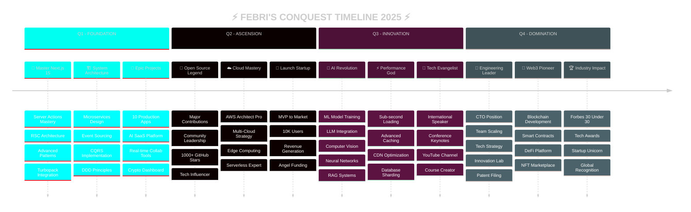

<div align="center">


<!-- EPIC 3D TYPING MATRIX -->
<picture>
  <source media="(prefers-color-scheme: dark)" srcset="https://readme-typing-svg.demolab.com?font=Orbitron&weight=900&size=55&duration=1200&pause=600&color=00FFF0&center=true&vCenter=true&multiline=true&repeat=true&width=1500&height=280&lines=%F0%9F%8C%8C+REALITY+BENDER+%F0%9F%8C%8C;%F0%9F%92%A0+ARCHITECT+OF+IMPOSSIBLE+%F0%9F%92%A0;%E2%9A%A1+FULL-STACK+WIZARD+%E2%9A%A1;%F0%9F%94%AE+CODE+IS+MY+CANVAS+%F0%9F%94%AE;%E2%9C%A8+INNOVATION+INCARNATE+%E2%9C%A8">
  
</picture>

<!-- LEGENDARY STATUS BADGES -->
<p align="center">
  
  
  
  
</p>

<!-- INSANE METRICS -->
<p align="center">
  
  
  
  
</p>


</div>

---

<!-- ULTIMATE TECH UNIVERSE -->
<div align="center">

##  DIGITAL ARSENAL 


### ⚡ FRONTEND DOMINION


### 🔥 BACKEND EMPIRE


### 💾 DATABASE KINGDOM


### 🎨 DESIGN REALM


### ☁️ DEVOPS GALAXY


</div>

---

<!-- GODLIKE STATS SECTION -->
<div align="center">

##  POWER METRICS 


</div>

<!-- MAIN STATS CARDS -->
<div align="center">

<a href="https://github.com/Febri-Silaen">
  
  
</a>

</div>

<!-- EPIC STREAK -->
<div align="center">


</div>

---

<!-- CONTRIBUTION GRAPH -->
<div align="center">

##  ACTIVITY MATRIX 


</div>

---

<!-- TROPHY SHOWCASE -->
<div align="center">

##  LEGEND TROPHIES 


</div>

---

<!-- ADVANCED ANALYTICS -->
<div align="center">

##  QUANTUM ANALYTICS 

</div>

<table align="center" width="100%">
<tr>
<td width="50%">

</td>
<td width="50%">

</td>
</tr>
<tr>
<td width="50%">

</td>
<td width="50%">

</td>
</tr>
<tr>
<td colspan="2">

</td>
</tr>
</table>

---

<!-- SNAKE ANIMATION -->
<div align="center">

##  CONTRIBUTION VORTEX 

<picture>
  <source media="(prefers-color-scheme: dark)" srcset="https://raw.githubusercontent.com/Platane/snk/output/github-contribution-grid-snake-dark.svg">
  <source media="(prefers-color-scheme: light)" srcset="https://raw.githubusercontent.com/Platane/snk/output/github-contribution-grid-snake.svg">
  
</picture>


</div>

---

<!-- 2025 MASTER PLAN -->
<div align="center">

##  2025 DOMINATION BLUEPRINT 

</div>



---

// 🌌 THE MANIFESTO
console.log("🔥 Great engineers don't follow trends");
console.log("   They CREATE them.");
console.log("⚡ Code is poetry in motion.");
console.log("✨ Innovation is not an option, it's oxygen.");
```


</div>

---

<!-- CONNECT SECTION -->
<div align="center">

##  ENTER MY UNIVERSE 


### 🌐 CONTACT PROTOCOLS

<p align="center">
  <a href="mailto:febri@gmail.com">
    
  </a>
  <a href="https://github.com/Febri-Silaen">
    
  </a>
  <a href="https://linkedin.com/in/febri-silaen">
    
  </a>
</p>

### ⚡ COLLABORATION MODES

<p align="center">
  
  
  
  
</p>


---


<p align="center">
  
  
</p>

</div>
