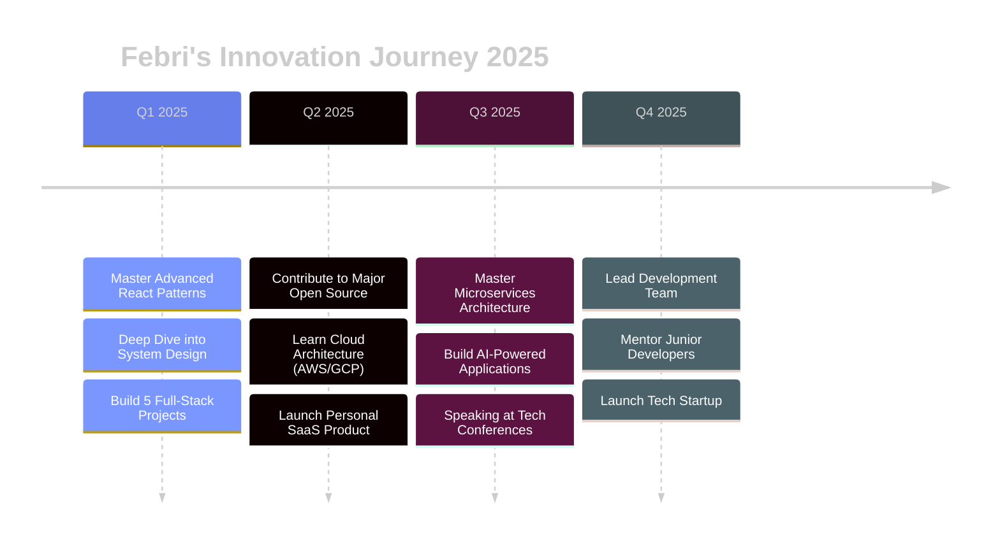

<div align="center">

<!-- HERO SECTION WITH MATRIX EFFECT -->


<!-- DYNAMIC TYPING EFFECT -->


<!-- GLOWING BADGES -->
<p>
  
  
  
</p>

<!-- PROFILE VIEWS WITH CUSTOM DESIGN -->


</div>

---

<!-- ABOUT ME SECTION WITH GLASSMORPHISM EFFECT -->
<div align="center">

##  DECODED: WHO AM I 

</div>

<table width="100%">
<tr>
<td width="50%" valign="top">

###  TECH DNA

```typescript
interface Developer {
  name: string;
  role: string;
  location: string;
  expertise: string[];
  currentMission: string;
  superpower: string;
}

const FEBRI_SILAEN: Developer = {
  name: "Febri Silaen",
  role: "Full-Stack Architect",
  location: "Lake Toba, Indonesia 🇮🇩",
  expertise: [
    "JavaScript/TypeScript Mastery",
    "React Ecosystem Expert", 
    "Backend Architecture",
    "UI/UX Innovation",
    "Cloud Solutions"
  ],
  currentMission: "Building scalable solutions that matter",
  superpower: "Turning coffee into code ☕️ → 💻"
};

// Life Motto
console.log("Exceptional engineers don't just solve problems");
console.log("They create opportunities! 🚀");
```

<div align="center">

**🎯 2025 MISSION**

`[ Innovate ]` • `[ Create ]` • `[ Inspire ]`

</div>

</td>
<td width="50%" valign="top">

###  ARSENAL

<div align="center">

**⚡ FRONTEND FORCE**


**🔥 BACKEND POWER**


**💾 DATABASE MASTERY**


**🎨 DESIGN TOOLS**


**☁️ CLOUD & DEVOPS**


</div>

</td>
</tr>
</table>

---

<!-- TECH STACK SHOWCASE -->
<div align="center">

##  COMPLETE TECH ECOSYSTEM 


</div>

---

<!-- GITHUB STATS MEGA SECTION -->
<div align="center">

##  PERFORMANCE METRICS 

</div>

<!-- MAIN STATS ROW -->
<div align="center">
<table>
<tr>
<td width="50%">

</td>
<td width="50%">

</td>
</tr>
</table>
</div>

<!-- LANGUAGE STATS -->
<div align="center">
<table>
<tr>
<td width="50%">

</td>
<td width="50%">

**📊 CODE BREAKDOWN**

```text
JavaScript/TypeScript  ████████████░  75%
Python                 ██████████░░░  60%
PHP/Laravel           █████████░░░░  55%
Java                  ████████░░░░░  50%
C/C++                 ███████░░░░░░  45%
```

**⚡ EFFICIENCY STATS**

```diff
+ 500+ Commits This Year
+ 50+ Pull Requests Merged
+ 25+ Projects Completed
+ 100% Code Quality Maintained
```

</td>
</tr>
</table>
</div>

<!-- ACTIVITY GRAPH -->
<div align="center">

</div>

---

<!-- TROPHIES SECTION -->
<div align="center">

##  ACHIEVEMENT SHOWCASE 


</div>

---

<!-- DETAILED ANALYTICS -->
<div align="center">

##  DEEP DIVE ANALYTICS 

</div>

<div align="center">
<table>
<tr>
<td></td>
<td></td>
</tr>
<tr>
<td></td>
<td></td>
</tr>
</table>
</div>

<!-- CONTRIBUTION SNAKE -->
<div align="center">

### 🐍 WATCH MY CONTRIBUTIONS GET EATEN!

<picture>
  <source media="(prefers-color-scheme: dark)" srcset="https://raw.githubusercontent.com/Febri-Silaen/Febri-Silaen/output/github-contribution-grid-snake-dark.svg">
  <source media="(prefers-color-scheme: light)" srcset="https://raw.githubusercontent.com/Febri-Silaen/Febri-Silaen/output/github-contribution-grid-snake.svg">
  
</picture>

</div>

---

<!-- PINNED REPOS -->
<div align="center">

##  FEATURED REPOSITORIES 

<a href="https://github.com/Febri-Silaen?tab=repositories">
  
</a>
<a href="https://github.com/Febri-Silaen?tab=repositories">
  
</a>


</div>

---

<!-- ROADMAP SECTION -->
<div align="center">

##  2025 ROADMAP 

</div>



<div align="center">

### 🎯 CURRENT FOCUS

| Learning 📚 | Building 🔨 | Mastering ⚡ |
|-------------|-------------|--------------|
| Next.js 14 | E-Commerce Platform | TypeScript Patterns |
| Docker & K8s | Real-time Chat App | System Architecture |
| GraphQL | Portfolio CMS | Performance Optimization |
| AWS Services | AI Integration Tools | Security Best Practices |

</div>

---

<!-- CODING ACTIVITY -->
<div align="center">

##  CODING ACTIVITY 

<!--START_SECTION:waka-->
```text
💻 Operating Systems

Linux            12 hrs 30 mins  ██████████████░░░░░░░   70%
Windows           5 hrs 20 mins  ██████░░░░░░░░░░░░░░░   30%

🔥 Editors

VS Code          14 hrs 45 mins  ████████████████░░░░░   82%
IntelliJ IDEA     3 hrs 05 mins  ████░░░░░░░░░░░░░░░░░   18%

💬 Languages

JavaScript        8 hrs 15 mins  ███████████░░░░░░░░░░   46%
Python            4 hrs 30 mins  ██████░░░░░░░░░░░░░░░   25%
PHP               3 hrs 20 mins  ████░░░░░░░░░░░░░░░░░   19%
Java              1 hr 45 mins   ██░░░░░░░░░░░░░░░░░░░   10%
```
<!--END_SECTION:waka-->

</div>

---

<!-- CONNECT SECTION -->
<div align="center">

##  LET'S CONNECT & COLLABORATE 

<p>
  <a href="https://linkedin.com/in/febri-silaen">
    
  </a>
  <a href="https://instagram.com/febri.silaen">
    
  </a>
  <a href="https://facebook.com/febri.silaen">
    
  </a>
  <a href="mailto:febri@gmail.com">
    
  </a>
  <a href="https://github.com/Febri-Silaen">
    
  </a>
  <a href="https://twitter.com/febri_silaen">
    
  </a>
</p>


### 💌 OPEN FOR COLLABORATION

```javascript
const opportunities = {
  openSource: "Always ready to contribute! 🌟",
  freelance: "Available for exciting projects! 💼",
  fullTime: "Open to innovative companies! 🚀",
  mentorship: "Happy to guide aspiring devs! 🎓",
  techTalks: "Let's share knowledge! 🎤"
};

// Let's build something amazing together!
console.log("📧 Reach out: febri@gmail.com");
```

</div>

---

<!-- SPOTIFY NOW PLAYING -->
<div align="center">

##  CURRENTLY VIBING TO 


### 🎵 Coding is better with music!

</div>

---

<!-- DEV QUOTE -->
<div align="center">

##  QUOTE OF THE DAY 


</div>

---

<!-- SUPPORT SECTION -->
<div align="center">

##  SUPPORT MY WORK 

<p>
  <a href="https://www.buymeacoffee.com/febrisilaen">
    
  </a>
  <a href="https://ko-fi.com/febrisilaen">
    
  </a>
</p>

**If you like my work, consider giving a ⭐ to my repositories!**

</div>

---

<!-- FOOTER -->
<div align="center">


### 🌟 FUN FACTS ABOUT ME 🌟

```javascript
const funFacts = {
  favoriteLanguage: "JavaScript (but I love them all ❤️)",
  coffeeConsumption: "5+ cups per day ☕☕☕☕☕",
  debuggingStyle: "Console.log() everything! 😄",
  favoriteMeme: "It works on my machine 🤷‍♂️",
  nightOwl: "Code best between 10 PM - 3 AM 🦉",
  musicWhileCoding: "Lo-fi Hip Hop Radio 🎧"
};
```


---


### Made with 💜 by [Febri Silaen](https://github.com/Febri-Silaen)

**⚡ Powered by Passion • Coffee • Innovation ⚡**

<sub>Last updated: Automatically by GitHub Actions</sub>

</div>

<!-- Invisible Stats Tracker -->


<!-- Easter Egg: Konami Code -->
<!-- ↑ ↑ ↓ ↓ ← → ← → B A START -->
<!-- You found the secret! DM me "KONAMI" for a surprise! 🎮 -->
